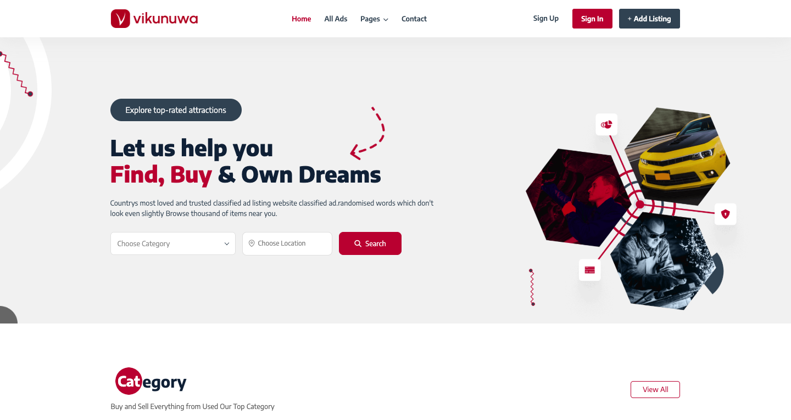
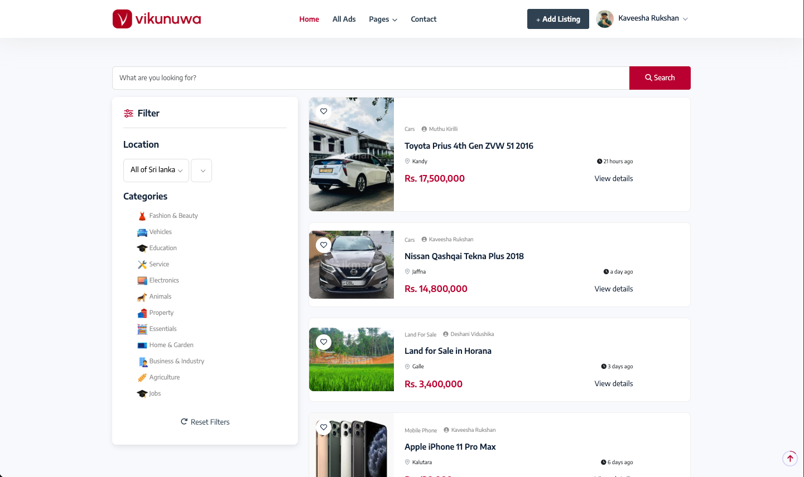
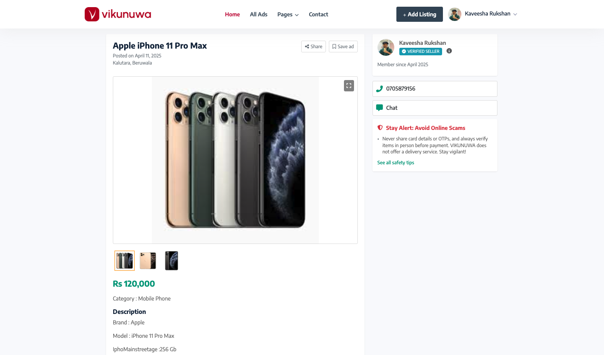
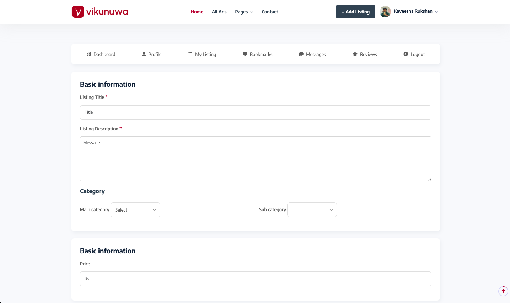
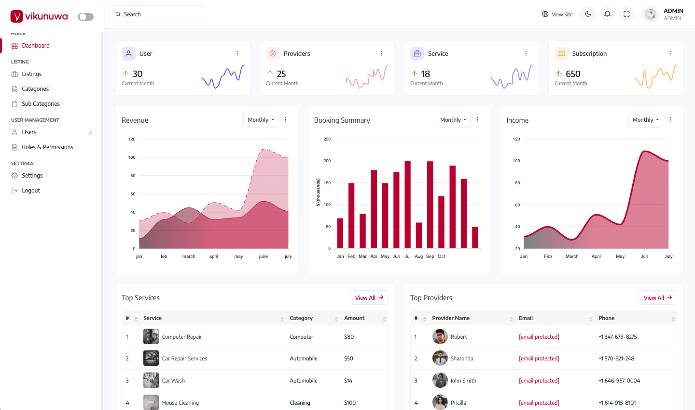

# 🛍️ vikunuwa.lk – Sri Lanka’s Local Classified Ad Platform

vikunuwa.lk is a fully functional classified advertisement platform. This web application allows users to post, browse, and manage ads across various categories such as vehicles, electronics, property, jobs, and services. Built with a modern tech stack, the platform supports ad posting with image uploads, location-based filtering, user authentication, and more.

---

## 📸 Screenshots

### 🔹 Home Page


### 🔹 All Ads Page


### 🔹 Ad Details Page


### 🔹 Post Ad Form


### 🔹 Admin Dashboard


---

## ⚙️ Setup Instructions

### 🧩 Prerequisites
- Java 17+
- Maven
- MySQL
- Any IDE (VS Code, IntelliJ, etc.)

---

### 🌐 Frontend Setup (HTML/CSS/JS)

1. Open the `AAD-FRONTEND` folder in VS Code or any IDE.
2. You can run the frontend using:
   - Live Server extension in VS Code **OR**
   - Simply open `index.html` in your browser.
3. Make sure the backend is running so the frontend can send API requests.

----

### 🖥️ Backend Setup (Spring Boot)

```bash
mvn clean install
mvn spring-boot:run
```

```
## Back end Installation

# Change into the project directory
  cd AAD-Backend

# Install frontend dependencies
  npm install

# Start the frontend development server
  npm run dev
```

---


### 🎥 Project explanation demo video


**YouTube video**
https://youtu.be/bNiqd0ZC3ek


---


